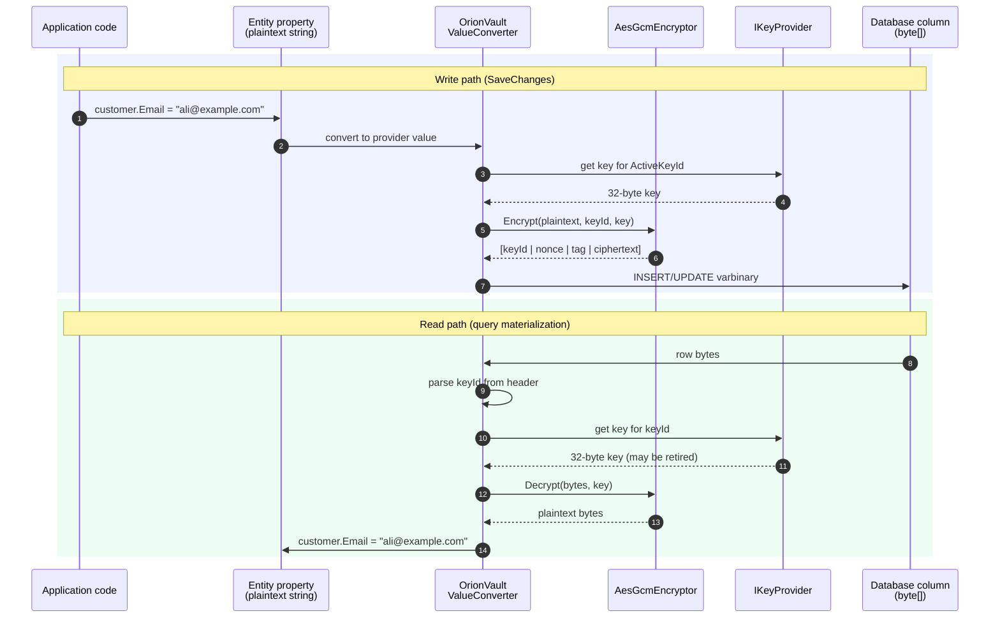
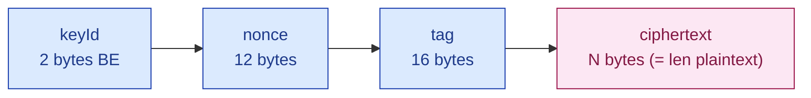

<p align="center">
  
</p>

<h1 align="center">OrionVault</h1>

<p align="center">
  Column-level transparent data encryption at rest for EF Core. AES-256-GCM, key rotation, bundled Roslyn analyzer, OpenTelemetry.
</p>

<p align="center">
  <a href="https://www.nuget.org/packages/Moongazing.OrionVault"></a>
  <a href="https://www.nuget.org/packages/Moongazing.OrionVault"></a>
  <a href="LICENSE"></a>
  
</p>

---

## What it does

OrionVault encrypts individual EF Core columns at rest. You mark a property with `[Encrypted]` (or call `IsEncrypted()` in `OnModelCreating`); OrionVault wires a value converter that encrypts on the way to the database and decrypts on the way back. The cipher is AES-256-GCM with a key id prefix so you can rotate keys without re-encrypting historical rows up front.

The threat model is narrow and explicit: an attacker who obtains a database backup, dumps the storage volume, or reads a replica's disk cannot read the protected columns without the active key set. Plaintext exists only inside authorized application processes that hold those keys.

This is not full-database TDE. It is not key management. It is the EF Core integration layer that sits on top of `System.Security.Cryptography.AesGcm` and a pluggable `IKeyProvider`. The v0.1.0 key provider is in-config (`UseStaticKeys`); cloud KMS providers (AWS, Azure, HashiCorp, DPAPI) are scheduled for v0.2 and v0.4.

## How it works

EF Core sees the property as `string` (or `byte[]`); the storage column is `byte[]`. A value converter sits between the two and routes through OrionVault's encryptor on write and decryptor on read.



The on-disk layout decoded above is fixed: a two-byte big-endian key id, a 12-byte AES-GCM nonce, a 16-byte authentication tag, then the ciphertext body. The reader pulls the key id first so it can ask the key provider for the exact key that wrote the row, which is what makes online key rotation work.



## What's in the box

| Package | Description |
|---------|-------------|
| `Moongazing.OrionVault` | Core: `IEncryptor`, `IKeyProvider`, `IEncryptionConfigurator`, AES-256-GCM cipher, static key provider, telemetry. Bundles the Roslyn analyzer (`analyzers/dotnet/cs/`). |
| `Moongazing.OrionVault.EntityFrameworkCore` | EF Core integration: `[Encrypted]` attribute, `IsEncrypted()` fluent API, value converter factory, `IModelCustomizer` wiring, `UseOrionVault()` extension. |
| `Moongazing.OrionVault.Testing` | Test helpers: `AddOrionVaultForTesting()` DI extension, deterministic `TestKeyProvider`, `PlaintextEncryptor` for raw-layout tests, `EncryptionAssertions`. |

All three packages multi-target `net8.0` / `net9.0` / `net10.0`. The analyzer ships inside the core package; there is no separate analyzers nupkg to install.

## 30-second quick start

Install the two runtime packages:

```bash
dotnet add package Moongazing.OrionVault
dotnet add package Moongazing.OrionVault.EntityFrameworkCore
```

Register OrionVault and bind it to your `DbContext`:

```csharp
using Microsoft.EntityFrameworkCore;
using Microsoft.Extensions.DependencyInjection;
using Moongazing.OrionVault.DependencyInjection;
using Moongazing.OrionVault.EntityFrameworkCore.DependencyInjection;

services.AddOrionVault(o =>
{
    o.UseStaticKeys(k =>
        k.Add(keyId: 1, base64Key: Environment.GetEnvironmentVariable("ORIONVAULT_KEY_1")!));
    o.ActiveKeyId = 1;
})
.UseEntityFrameworkCore<AppDbContext>();

services.AddDbContext<AppDbContext>((sp, opt) =>
    opt.UseNpgsql(connectionString).UseOrionVault(sp));
```

Mark the columns you want encrypted:

```csharp
using Moongazing.OrionVault.EntityFrameworkCore;

public class Customer
{
    public Guid Id { get; set; }
    public string FullName { get; set; } = null!;

    [Encrypted]
    public string Email { get; set; } = null!;

    [Encrypted]
    public string IbanLast4 { get; set; } = null!;
}
```

Or use the fluent API in `OnModelCreating`:

```csharp
protected override void OnModelCreating(ModelBuilder modelBuilder)
{
    modelBuilder.Entity<Customer>().Property(c => c.Email).IsEncrypted();
    modelBuilder.Entity<Customer>().Property(c => c.IbanLast4).IsEncrypted();
}
```

That's it. `SaveChanges` writes ciphertext, queries read it back as plaintext. The column type in the database becomes `byte[]` (`varbinary` / `bytea` / `BLOB` depending on provider).

## The cipher format

Every encrypted value lives in the database as a single `byte[]` with a fixed 30-byte header followed by the ciphertext body:

```
+---------+----------+----------+--------------------+
| keyId   | nonce    | tag      | ciphertext         |
| 2 bytes | 12 bytes | 16 bytes | N bytes (= len(pt))|
| BE      |          |          |                    |
+---------+----------+----------+--------------------+
   ^^^^^^^^^^^^^^^^^^^^^^^^^^^^^^^^^^^^^^^^^^^^^^^^^^^
   30-byte fixed overhead       payload
```

- `keyId` is the big-endian 16-bit identifier of the key used to encrypt this row. The decryptor reads it first and asks `IKeyProvider` for that exact key.
- `nonce` is freshly generated per encryption via `RandomNumberGenerator`. The AES-GCM nonce reuse rule (never reuse `(key, nonce)`) is honored because every encryption draws a new nonce.
- `tag` is the 128-bit GCM authentication tag.
- `ciphertext` is the same length as the original plaintext.

A UTF-8 email like `ali@example.com` (15 bytes) becomes 45 bytes on disk: 30 header + 15 body.

## Key rotation

OrionVault supports multi-key read, single-key write. You declare every key the host might encounter; `ActiveKeyId` chooses which one is used for new writes:

```csharp
services.AddOrionVault(o =>
{
    o.UseStaticKeys(k =>
    {
        k.Add(keyId: 1, base64Key: oldKeyBase64);
        k.Add(keyId: 2, base64Key: newKeyBase64);
    });
    o.ActiveKeyId = 2;
});
```

After this configuration:

- New rows are encrypted under key 2.
- Existing rows that were written under key 1 are still decrypted correctly because key 1 is still registered.
- A row encrypted under a key that is not registered throws `OrionVaultKeyNotFoundException` on read.

To actually retire key 1, re-encrypt existing rows by running them through `SaveChanges` once (load entity, mark a tracked property modified, save). The value converter encrypts under the current `ActiveKeyId`. v0.1.0 has no built-in drain service; a background hosted service to walk the table and re-write rows is on the v0.2 roadmap.

## Searchable encrypted columns

AES-GCM is randomized: encrypting the same plaintext twice produces different ciphertext. That means SQL `WHERE Email = @p` does not work against an encrypted column. The Roslyn analyzer warns about this at compile time (`OV0002`).

The supported pattern is an HMAC-SHA256 index column populated alongside the encrypted value:

```csharp
public class Customer
{
    public Guid Id { get; set; }

    [Encrypted]
    public string Email { get; set; } = null!;

    // Deterministic HMAC of Email. Searchable, irreversible, length-stable.
    public byte[] EmailIndex { get; set; } = null!;
}

// On the write path:
customer.Email = email;
customer.EmailIndex = HMACSHA256.HashData(searchKey, Encoding.UTF8.GetBytes(email.ToLowerInvariant()));

// On the read path:
var probe = HMACSHA256.HashData(searchKey, Encoding.UTF8.GetBytes(needle.ToLowerInvariant()));
var hit = await db.Customers.SingleOrDefaultAsync(c => c.EmailIndex == probe);
```

The HMAC key should be separate from the encryption key. A first-class convention for index columns is on the v0.3 roadmap; for now you wire it manually.

## Roslyn analyzer

Three diagnostics ship inside the core nupkg's `analyzers/dotnet/cs/` directory. No separate install.

| Id      | Severity | Catches |
|---------|----------|---------|
| OV0001  | Error    | `[Encrypted]` on a property whose type is not `string` or `byte[]`. |
| OV0002  | Warning  | LINQ `Where`/`==` comparison against an encrypted column (always returns false). |
| OV0003  | Info     | LINQ `OrderBy` / `GroupBy` on an encrypted column (executes client-side after decryption). |

Suppress per-call site with `#pragma warning disable OV0002` when you know what you are doing (for example, fetching a single row by primary key and filtering in memory).

## Telemetry

OrionVault publishes one `ActivitySource` and one `Meter`, both named `Moongazing.OrionVault`:

- Counters: `orionvault.encryptions`, `orionvault.decryptions`, `orionvault.decryption.failures`, `orionvault.key_lookups`, `orionvault.key_not_found`.
- Histogram: `orionvault.encryption.duration_ms`.

Subscribe with the standard OpenTelemetry .NET helpers:

```csharp
using OpenTelemetry.Metrics;

services.AddOpenTelemetry().WithMetrics(m => m
    .AddMeter("Moongazing.OrionVault")
    .AddPrometheusExporter());
```

Spans wrap individual encrypt and decrypt operations and are useful when correlating slow `SaveChanges` calls or unexpected decryption failures.

## Benchmarks

See [benchmarks.md](benchmarks.md) for the scenarios we plan to measure (encrypt and decrypt throughput across payload sizes, value-converter overhead vs. a manual `ValueConverter`, key-lookup contention) and the comparison baselines we will report against. A formal `bench/Moongazing.OrionVault.Bench` project is on the v0.2 roadmap.

## Testing

The `Moongazing.OrionVault.Testing` package wires a deterministic key provider and the real AES-GCM encryptor for fast unit tests:

```csharp
using Moongazing.OrionVault.Testing.DependencyInjection;
using Moongazing.OrionVault.EntityFrameworkCore.DependencyInjection;

var services = new ServiceCollection()
    .AddOrionVaultForTesting()
    .UseEntityFrameworkCore<TestDbContext>()
    .Services
    .AddDbContext<TestDbContext>((sp, opt) =>
        opt.UseSqlite("Data Source=:memory:").UseOrionVault(sp))
    .BuildServiceProvider();
```

Inspect raw column bytes with `EncryptionAssertions`:

```csharp
var raw = await db.Database.SqlQuery<byte[]>($"SELECT Email AS Value FROM Customers").SingleAsync();

EncryptionAssertions.IsEncrypted(raw);
EncryptionAssertions.IsEncryptedWithKey(raw, expectedKeyId: 1);
```

If you want to bypass real cryptography in a test that is asserting wiring rather than crypto, register `PlaintextEncryptor` instead and read the header bytes directly.

## Veil vs OrionVault

These two libraries solve adjacent but different problems and a project may use one, the other, or both:

- **`Moongazing.Veil`** masks PII in **outputs** (logs, API responses, serialized DTOs). A value like `ali@example.com` is stored as plaintext in the database and shows up as `a**@e******.com` in serialized output. The threat being mitigated is shoulder-surfing, accidental log exposure, and overly chatty error responses.

- **`Moongazing.OrionVault`** encrypts PII in **storage**. The value is ciphertext on disk; the application sees plaintext after the value converter decrypts it. The threat being mitigated is a leaked backup, a stolen disk, or unauthorized direct database access.

Veil does not protect against a database leak. OrionVault does not protect against a chatty log statement. Use Veil for what humans see, use OrionVault for what disks hold.

## How it compares

| Feature                                | OrionVault | EntityFrameworkCore.DataEncryption | Manual `ValueConverter` | AspNetCore.DataProtection |
|----------------------------------------|:----------:|:----------------------------------:|:-----------------------:|:-------------------------:|
| AES-256-GCM (AEAD)                     | Yes        | AES-CBC by default                 | You choose              | Yes                       |
| Key rotation (multi-read, single-write)| Yes        | Partial                            | You build               | Yes                       |
| Per-row key id in ciphertext           | Yes        | No                                 | You build               | Yes (in payload)          |
| `[Encrypted]` attribute                | Yes        | Yes                                | -                       | -                         |
| Fluent `IsEncrypted()` API             | Yes        | Yes                                | -                       | -                         |
| Roslyn analyzer (type + query)         | Yes        | No                                 | -                       | -                         |
| OpenTelemetry counters and spans       | Yes        | No                                 | No                      | Limited                   |
| Test helpers package                   | Yes        | No                                 | -                       | -                         |
| Target frameworks                      | net8/9/10  | net6+                              | -                       | net6+                     |
| Designed for EF Core specifically      | Yes        | Yes                                | Yes                     | No                        |
| Built-in cloud KMS                     | v0.2       | No                                 | -                       | Via extensions            |

OrionVault is not the only column-encryption story in the .NET ecosystem; it is the one that ships an analyzer, telemetry, and a Testing package out of the box, with a deliberately small API surface. If you already have a working `EntityFrameworkCore.DataEncryption` setup and are happy with it, there is no urgent reason to migrate.

## Orion family

OrionVault is one of several standalone .NET libraries. None depend on another at runtime.

- [OrionGuard](https://github.com/tunahanaliozturk/OrionGuard) - input validation, guard clauses, DDD primitives.
- [OrionAudit](https://github.com/tunahanaliozturk/OrionAudit) - EF Core audit trail with JSON Patch diffs and time-travel reconstruction.
- [OrionLock](https://github.com/tunahanaliozturk/OrionLock) - distributed lock primitive with auto-renewing leases.
- [OrionKey](https://github.com/tunahanaliozturk/OrionKey) - source-generated strongly-typed IDs.
- [OrionPatch](https://github.com/tunahanaliozturk/OrionPatch) - transactional outbox primitive with pluggable sinks.

Each ships separately on NuGet.

## Roadmap

See [ROADMAP.md](ROADMAP.md) for the full 12-month plan. Highlights:

- v0.2 (2026-Q4) - AWS KMS provider, Azure Key Vault provider, background re-encryption hosted service, multi-DbContext support.
- v0.3 (2027-Q1) - Numeric / DateTime / decimal column types; first-class HMAC index convention; migration helper for converting existing plaintext columns.
- v0.4 (2027-Q1/Q2) - Windows DPAPI provider, HashiCorp Vault provider, per-tenant key partitioning.
- v1.0 (2027-Q2) - Public API surface freeze and compliance documentation (KVKK, GDPR, PCI-DSS mapping).

If something on the list matters to you, open an issue with the `roadmap` label.

### See it in a real app

[Moongazing.OrionShowcase](https://github.com/tunahanaliozturk/OrionShowcase) is a production-shaped banking sample integrating all six Orion packages end-to-end. OrionVault encrypts customer PII columns (TCKN, email, phone) as bytea on Postgres. The integration test reads raw bytes directly and verifies the [keyId|nonce|tag|ciphertext] header layout. Concrete usage:

- [src/Moongazing.OrionShowcase.Infrastructure/Persistence/Configurations/CustomerConfiguration.cs](https://github.com/tunahanaliozturk/OrionShowcase/blob/main/src/Moongazing.OrionShowcase.Infrastructure/Persistence/Configurations/CustomerConfiguration.cs)
- [test/Moongazing.OrionShowcase.IntegrationTests/Scenarios/PiiEncryptionTests.cs](https://github.com/tunahanaliozturk/OrionShowcase/blob/main/test/Moongazing.OrionShowcase.IntegrationTests/Scenarios/PiiEncryptionTests.cs)

## License

MIT. See [LICENSE](LICENSE).

## Contributing

Issues and pull requests are welcome. Please open an issue first for anything larger than a bug fix or a docs tweak so we can agree on the shape before you spend time on it.
